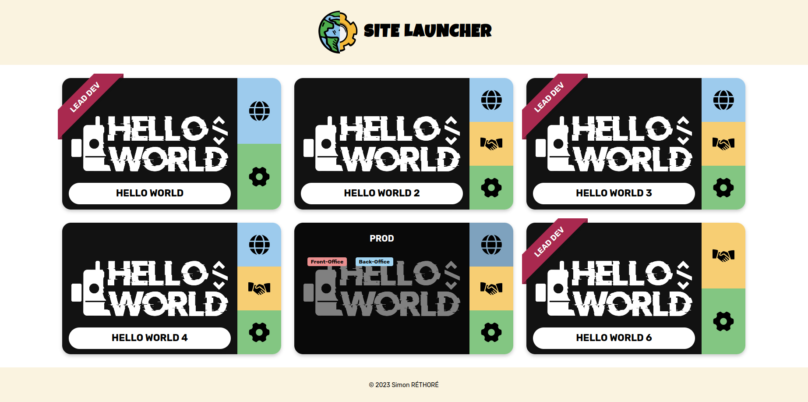

<div align="center"></div>
<h1 align="center">Site Launcher</h1>

<br/>

Site Launcher is a web application which has purpose to simplify the developer's life by saving their working web application's links under multiple environments.

Currently the application supports 3 environments (Dev, Preprod and Prod) and 7 types of tags for links (front, back, extranet, api, github, gitlab and sentry)



## Project setup

First you can start by cloning the repository.

```bash
git clone https://github.com/SimonRethore/site-launcher.git
```

Then you can run locally:

```bash
make install # TO CREATE DOCKER CONTAINERS & INSTALL DEPENDENCIES
```

```bash
make start # TO START CONTAINERS
```

## Usage

Add your data in the assets directory:
- `/images` for the site's image
- `data.json` to define data that will be used by the app

```json
[
    {
        "name" : "Hello World",
        "image" : "images/hello-world.jpg",
        "lead": true,
        "environments": [
            { 
                "name": "Prod", 
                "links": [
                    { 
                        "name": "Front-Office",
                        "tag": "front",
                        "value": "https://hello-world.fr"
                    },
                    { 
                        "name": "Back-Office",
                        "tag": "back",
                        "value": "https://hello-world.fr/admin"
                    }
                ] 
            },
            { 
                "name": "Dev", 
                "links": [
                    { 
                        "name": "Front-Office",
                        "tag": "front",
                        "value": "http://localhost:80"
                    },
                    { 
                        "name": "Back-Office",
                        "tag": "back",
                        "value": "http://localhost:80/admin"
                    }
                ] 
            }
        ]
    }
]
```